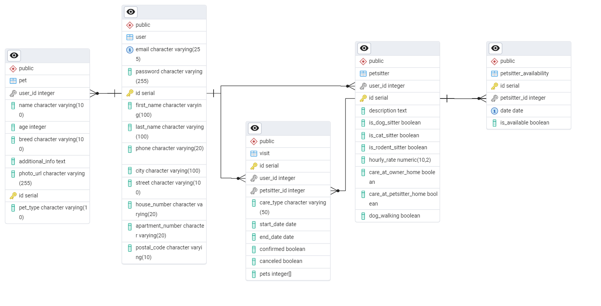

# Petzone

## Table of Contents

- [Project Description](#project-description)
- [Architecture Diagram](#architecture-diagram)
- [Technologies](#technologies)
- [Installation and Setup](#installation-and-setup)
- [Database Structure (ERD)](#database-structure-erd)
- [Authors](#authors)

---

## Project Description

**Petzone** is a modern web platform connecting pet owners with trusted petsitters.  
Key features:
- User registration and authentication (owners, petsitters, admin)
- User profile and pets management
- Petsitter search by filters and availability
- Booking and managing visits
- Petsitter availability management
- Admin panel 

---

## Architecture Diagram

```
+-------------------+         +-------------------+
|    Frontend       |         |     Backend       |
|    (React.js)     | <-----> |   (Django REST)   |
+-------------------+         +-------------------+
         |                              |
         |  REST API (JWT Auth)         |
         |------------------------------|
         |                              |
+-------------------+         +-------------------+
|   Database        |         |  Services/Repos   |
|   (PostgreSQL)    |         |  (Django ORM)     |
+-------------------+         +-------------------+
```

---

## Technologies

- **Django + Django REST Framework** – Secure, scalable, and fast backend API development.
- **PostgreSQL** – Robust relational database, perfect for complex queries and reliability.
- **React.js** – Modern, component-based frontend for interactive UIs.
- **JWT** – Secure, stateless authentication.
- **Docker & Docker Compose** – Unified, reproducible dev and deployment environments.
- **PgAdmin** – Easy database management via web UI.

**Why these?**  
These technologies are popular, well-documented, and proven in production for scalable web applications.

---

## Installation and Setup

### Requirements

- [Docker](https://www.docker.com/) & [Docker Compose](https://docs.docker.com/compose/)

### Quick Start

1. **Clone the repository**

git clone https://github.com/alicjanitecka/ZTPAI.git
cd petzone

2. **Configure environment variables**

Create a `.env` file in the root directory with at least:

POSTGRES_DB
POSTGRES_USER
POSTGRES_PASSWORD
PGADMIN_EMAIL
PGADMIN_PASSWORD
SECRET_KEY
DEBUG

3. **Build and run the app**
   docker-compose up --build

4. **Access the services:**
- **Frontend:** [http://localhost:5173](http://localhost:5173)
- **Backend API:** [http://localhost:8000](http://localhost:8000)
- **PgAdmin:** [http://localhost:5050](http://localhost:5050)

5. **Create a superuser (admin)**
   docker-compose exec backend python manage.py createsuperuser

---

## Database Structure (ERD)

Below is a simplified entity-relationship diagram:



## Authors

- Alicja Nitecka
